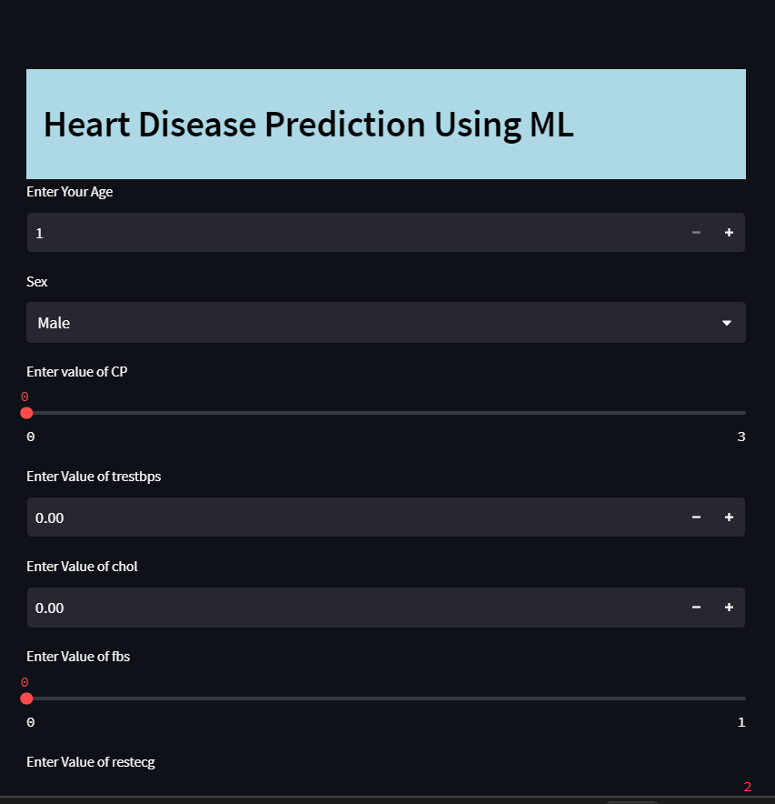
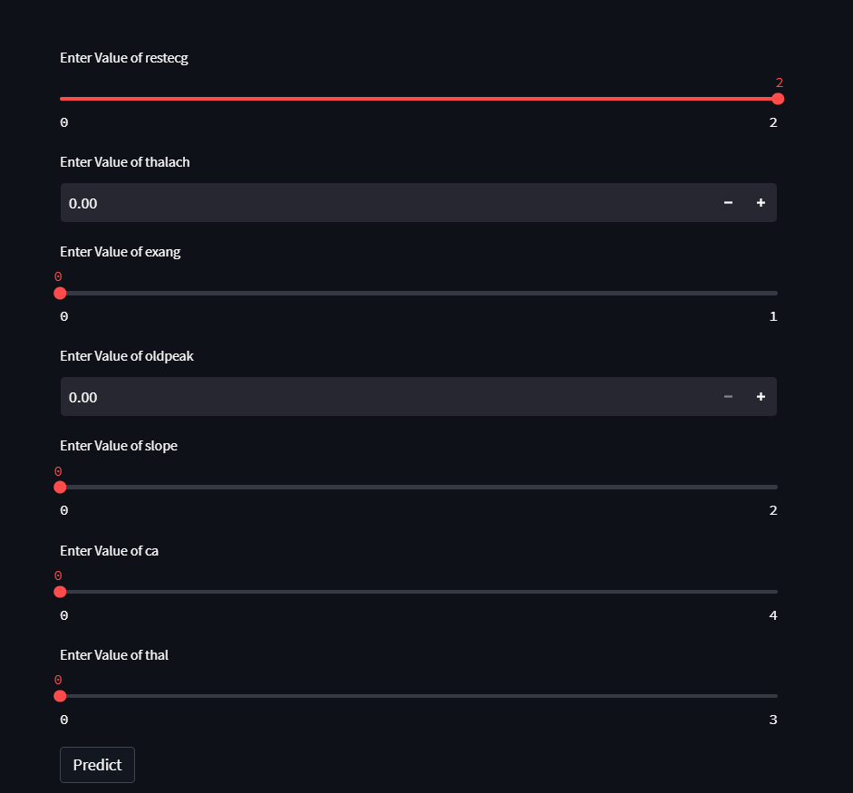
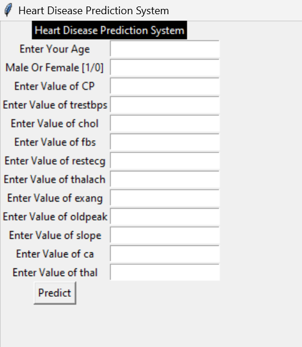

# Heart-Disease_predictor
##
it's a ML based heart disease predictor that is deployed in Web in streamlit and also deployed in GUI using tkinter.
##
use command streamlit run app.py after downloading the codes
##

##

##
you can directly use it by the GUI
##
 
